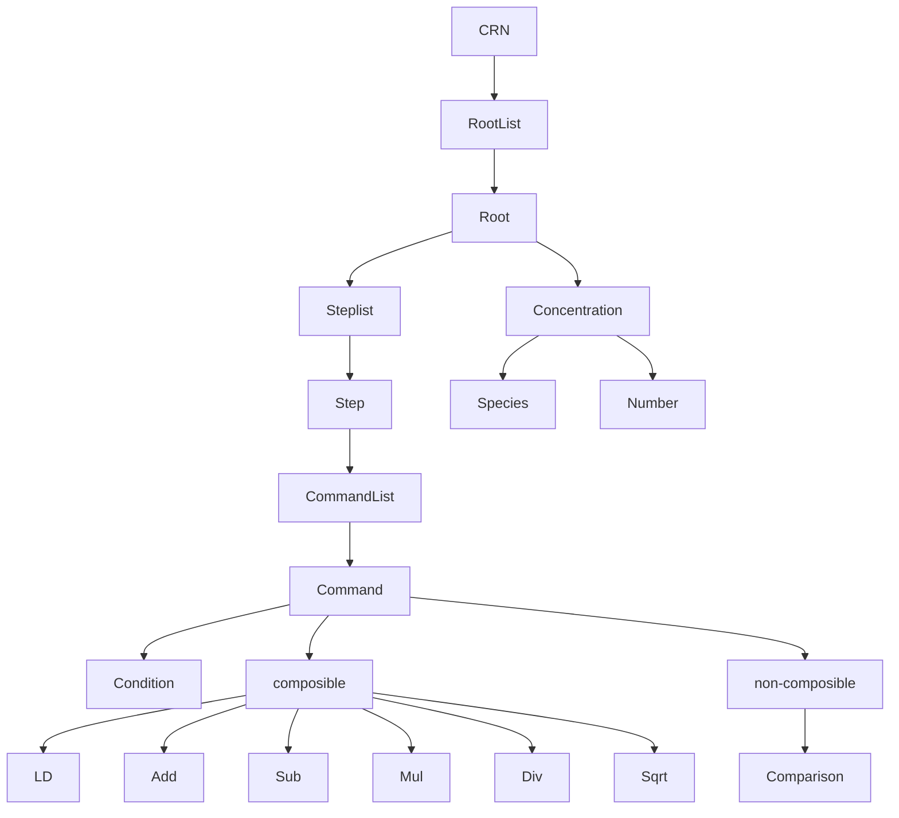

```mermaid
    graph TB
    CRN[CRN]
    RootList[RootList]
    Root[Root]
    Concentration[Concentration]
    Step[Step]
    CommandList[CommandList]
    Command[Command]
    Condition[Condition]
    Comparison[Comparison]
    LD[LD]
    Add[Add]
    Sub[Sub]
    Mul[Mul]
    Div[Div]
    Sqrt[Sqrt]
    
    Species[Species]
    Number[Number]

    CRN --> RootList
    RootList --> Root
    Root --> Concentration
    Concentration --> Species
    Concentration --> Number
    Root --> Steplist --> Step
    Step --> CommandList
    CommandList --> Command
    Command --> Condition
    Command --> composible
    Command --> non-composible
    composible --> LD
    composible --> Add
    composible --> Sub
    composible --> Mul
    composible --> Div
    composible --> Sqrt
    non-composible --> Comparison
    
```