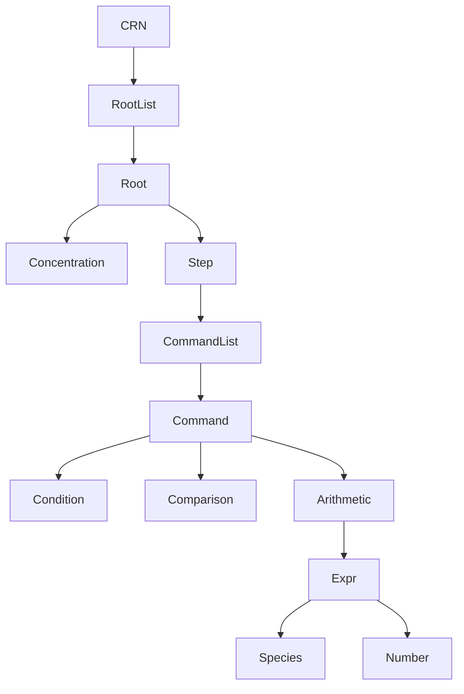

```mermaid
    graph TB
    CRN[CRN]
    RootList[RootList]
    Root[Root]
    Concentration[Concentration]
    Step[Step]
    CommandList[CommandList]
    Command[Command]
    Condition[Condition]
    Comparison[Comparison]
    Arithmetic[Arithmetic]
    Expr[Expr]
    Species[Species]
    Number[Number]

    CRN --> RootList
    RootList --> Root
    Root --> Concentration
    Root --> Step
    Step --> CommandList
    CommandList --> Command
    Command --> Condition
    Command --> Comparison
    Command --> Arithmetic
    Arithmetic --> Expr
    Expr --> Species
    Expr --> Number
```