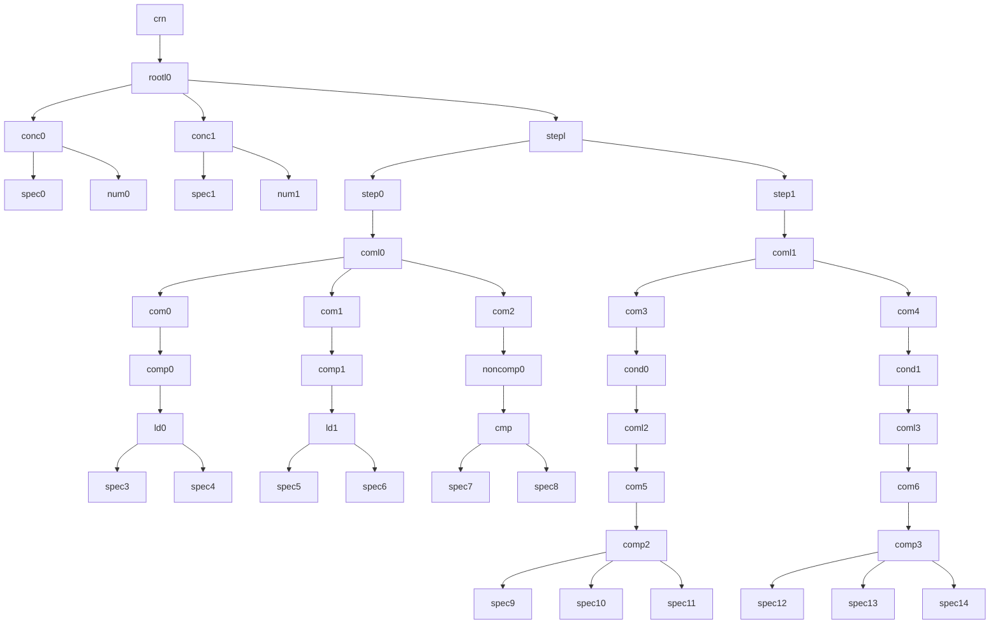

# Grammar verification

In this document we will test our grammar and syntax rules on all provided examples to show that the grammar we have made is compatible with all programs from the original article.

## GCD

See Fig 3. (a)

```
crn = {
    conc[a,a0], 
    conc[b,b0], 
    step[{ 
        ld[a, atmp], 
        ld[b, btmp],
        cmp[a,b] 
    }], 
    step[{
        ifGT[{ sub[atmp,btmp,a] }],
        ifLT[{ sub[btmp,atmp,b] }] 
    }] 
};
```

